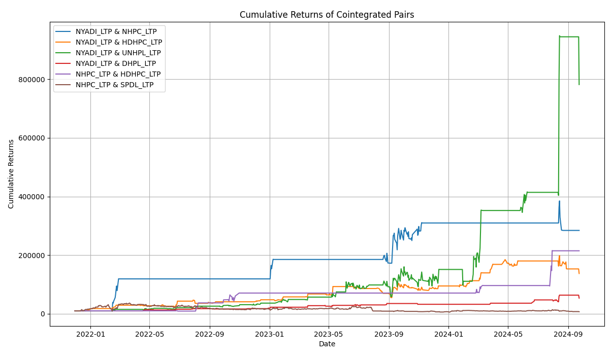

Day 1 of #CreatingQuantitativeStrategiesforNepse

Today, I focused on debugging my scrapper tool to efficiently collect stock trade data. The code often crashed due to page load times, so I implemented several fixes.

Steps Taken:
- Set up Selenium with ChromeDriver for browser automation.
- Implemented a web scraper to gather essential stock data, including Date, LTP, Volume, and Turnover.
- Iterated through multiple pages of stock data.
- Saved the collected data into CSV format for future analysis.

This foundational work paves the way for analyzing historical stock trends in the Nepalese market as we advance toward more complex models.

Day 2 of #CreatingQuantitativeStrategiesforNepse
Today, I created a backtesting tool accounting for 3 day minimum holding period and 0.1% broker commission.
Simulated trades on API stocks using MACD and RSI signals and combined these strategies.
MACD remained a strong with 7x returns but it has higher volatility. (Sharpe of 0.77)
RSI has bad metrics across the board.

Day 3: Creating Quantitative Strategies for NEPSE 🌟

Today, I made significant strides in my journey to develop quantitative trading strategies for the Nepal Stock Exchange (NEPSE). Used AI to improve the readability of the code.

🔍 Batch Scraping: I enhanced my data collection process by implementing batch scraping techniques, allowing me to gather floorsheet trading data for multiple stock symbols in one go. This not only saves time but also enables a more comprehensive analysis of market trends.

💻 Key Highlights:
Automated data extraction using Selenium and Python.
Inputting date ranges to collect historical floorsheet trading data systematically.
Efficiently managing multiple stock symbols in a single scraping session.
📈 The data collected will be instrumental in developing robust quantitative models and strategies tailored for NEPSE. Excited to see where this journey leads!

Day 4 of #CreatingQuantitativeStrategiesforNepse
🎯 Pairs Trading Strategy for Nepse Stocks! 📊
I’m excited to share the completion of my latest backtesting project using a Pairs Trading Strategy based on statistical arbitrage! Here’s a breakdown of how it works:

How It Works:
Stock Selection: We identified pairs of stocks exhibiting strong historical price correlations using the Engle-Granger cointegration test.

Mean Reversion: The strategy operates on the assumption that when the price spread between two stocks deviates beyond a certain threshold, it will revert to its mean. We enter trades when the spread hits an extreme level and exit when it returns to normal.

Backtesting with Monte Carlo Simulation:
To optimize the trading parameters, I conducted 1,000 Monte Carlo simulations, varying rolling windows and thresholds for entering and exiting trades.

The simulations were crucial in optimizing key parameters, such as Z-score entry/exit thresholds and holding periods, aimed at maximizing risk-adjusted returns.

A 5% stop-loss was set to manage risk effectively. The starting capital was 10k. Min holding day was 3 days and 0.04% was set as broker commission.

Performance Metrics:
The strategy was evaluated using the Sharpe Ratio, Sortino Ratio, and Max Drawdown to prioritize risk-adjusted returns. Here are some top-performing pairs from the backtest:

The strategy achieved exceptionally high Sharpe Ratios in some pairs with minimized drawdowns, indicating strong performance with controlled risk.

However, the returns are abnormally high, and I will verify the dataset's integrity to ensure accuracy.

Day 5 of #CreatingQuantitativeStrategiesforNepse
Trading Strategy Optimization for Nepse Stocks! 📈

I'm thrilled to share the latest enhancements and results from my Pairs Trading Strategy project! Building on the insights from my previous backtesting, I've made significant improvements to refine our trading approach. Here’s what we accomplished:

Key Improvements:
Enhanced Parameter Search: Incorporated multiple stop-loss thresholds (5, 10, 15, and 20) to better manage risk and protect capital.
Sharpe Ratio Calculation Fix: Adjusted the calculation method to ensure accurate performance evaluation, giving us clearer insights into risk-adjusted returns.
Refined Trade Logic: Now allocating 50% of funds to each stock, allowing for simultaneous trading when entry thresholds are met, enhancing our trading flexibility.

Starting Capital was $10,000.

Performance Highlights:
Top Performing Pairs:
NYADI & NHPC: Final cumulative return of $24,422.86 with a Sharpe ratio of 1.79 and a win rate of 64%.
NYADI & HDHPC: Achieved returns of $19,379.21 with a profit factor of 1.81.
NYADI & UNHPL: Delivered $17,111.87 and an impressive Sortino ratio of 4.35.

Day 6 of #CreatingQuantitativeStrategiesforNepse

Today, I focused on generating buy signals for stock pairs using parameters derived from our backtesting.

The robust stocks from our backtest were NYADI, NHPC and NYADI, DHPL.

For the pair NYADI and NHPC, the analysis indicated a rolling window of 7, with entry thresholds of -1.26 and 2.43. The signal suggested holding the current position or staying out, as the Z-score was -0.94.

In contrast, the pair NYADI and DHPL showed a rolling window of 15, with entry thresholds of -1.96 and 1.01. Here, the signal recommended entering a position to buy NYADI, as the Z-score has already reached -2.67.

Day 7 of #CreatingQuantitativeStrategiesforNepse
Today, I made significant strides in my project by collecting stock data across various sectors, including banking, hydropower, microfinance, and reinsurance. 

After conducting thorough backtesting, I observed a low success rate in banking stocks, while hydropower, microfinance, and reinsurance sectors showed promising results. 

Key accomplishments:
Enhanced my data scrapper to eliminate duplication, ensuring that the datasets collected are clean and accurate.
Refined my approach to backtesting, yielding actionable insights into the performance of different sectors.
Focused on improving the data alignment and cleaning processes to facilitate more effective quantitative strategies.

Looking forward to Day 8, I am continuing my research on the application of the Ornstein–Uhlenbeck process to NEPSE. I also want to collect orderbook data for visualization using flux. Excited for what lies ahead!

Day 8 of #CreatingQuantitativeStrategiesforNepse

(Disclaimer: This should not be taken as investment advice and is for research only.)

Building on yesterday’s work, I’ve taken my strategy development a step further by implementing advanced techniques to optimize performance and generate actionable signals:

🔄 Backtested Across Sectors: Refined strategy with sector-specific and cross-sector stock pairs for banking, hydropower, microfinance, and reinsurance.

🎲 Monte Carlo Simulation: Applied Monte Carlo methods to select the best risk-adjusted returns, optimizing Sharpe ratios while minimizing drawdowns.

📊 Automated Signal Generation: Took optimized parameters, generated buy/exit signals, and validated them across multiple stocks.

📈 Insights: Calculated the number of buy signals per stock to guide future trading decisions.

Step by step, we're moving closer to creating robust, data-driven quantitative strategies for Nepse!